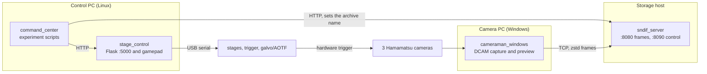

# plSCM

This repository contains the operation code for the plSCM microscope. The plSCM
is a line-scanning microscope with three channels. It moves a laser sheet with a
galvo. The movement of the sheet agrees with the rolling shutter of three
Hamamatsu cameras. The system sends the frames of about 10 MB to a
storage host in real time.

The repository contains four programs. The programs operate on three computers.
They use USB serial, HTTP, and TCP to send data. There is no single start
command. See [Start-up procedure](#start-up-procedure) for the correct sequence.



## Contents of the repository

| Directory | Language | Function |
|---|---|---|
| [`stage_control/`](stage_control/) | Python | Operates on the control PC. Controls all the serial devices. There are two Newport ESP stage controllers and four Raspberry Pi Pico devices. Gives access to them through an HTTP API on port 5000. Also controls the stage from an Xbox gamepad. |
| [`command_center/`](command_center/) | Python | Contains the experiment logic and the calibration procedure. Sends commands to the HTTP API. Does not use the serial ports. |
| [`cameraman_windows_stateless/`](cameraman_windows_stateless/) | C++ and Visual Studio | Operates on the camera PC. Captures data from three cameras with DCAM-API. Compresses each frame with zstd. Sends the frame to the storage host. Shows a live preview. |
| [`sndif_server/`](sndif_server/) | Rust | Operates on the storage host. Receives the frames. Sorts them by camera. Writes them to one zip archive for each channel. |
| [`sndif_test_client/`](sndif_test_client/) | Rust | Makes test data to test the frame injection process. |

The name "stateless" tells you that the camera application keeps no experiment
data. The application operates continuously and sends each frame immediately.
The storage host puts each frame in the correct archive. To do this, the storage
host uses the last name that it received on its control port.

## Documentation

| Document | Contents |
|---|---|
| [Architecture](docs/architecture.md) | The parts of the system, the three time scales, the threads, and the ports |
| [Operations](docs/operations.md) | Prerequisites, start-up procedure, how to do a scan, and troubleshooting |
| [Control API](docs/control-api.md) | The HTTP endpoints and the ESP and Pico serial protocols |
| [Frame protocol](docs/frame-protocol.md) | The data format between the camera and the storage host |
| [Calibration](docs/calibration.md) | How to make the galvo wavetables and the contents of each `.p` file |

Read [Architecture](docs/architecture.md) first. Then read
[Operations](docs/operations.md). These two documents give you enough data to do
a scan.

## Start-up procedure

Do the steps in this sequence. The camera application makes a new connection for
each frame. The experiment scripts need the two servers.

```bash
# 1. Storage host. The server writes the archives to the work directory.
#    An environment variable can set the directory, the ports, and the
#    number of cameras. See docs/operations.md.
cd /data/plscm && sndif_server

# 2. Control PC. The program resets the Pico devices and reads the wavetables.
cd stage_control && python run.py
curl http://localhost:5000/           # The reply is: Server up.

# 3. Camera PC. Start cameraman_windows.exe (x64 Release).
```

Then move the stage to the home position and do a scan. For the full procedure,
see [Operations](docs/operations.md#how-to-do-a-scan).

## Ports

| Port | Computer | Function |
|---|---|---|
| 5000 | Control PC | Controls the stage, the trigger, the galvo, and the AOTF |
| 5001 | Control PC | The camera preview service. This service is not in this repository. |
| 8080 | Storage host | Receives the frames (TCP) |
| 8090 | Storage host | Sets the archive name (HTTP) |

## How to build

```bash
# The Rust programs
cd sndif_server && cargo build --release

# The Python programs
pip install pyserial flask tqdm requests tifffile numpy scipy zstd matplotlib
```

For the Windows camera application you must have these items. You must have
Visual Studio with the C++ desktop workload. You must have the Hamamatsu
DCAM-API SDK and runtime, which is available from the vendor.
You must also have zstd from vcpkg (`vcpkg install zstd:x64-windows`). Open
[`cameraman_windows.sln`](cameraman_windows_stateless/cameraman_windows.sln) and
build the x64 Release configuration.

## Data to know before you make a change

- **Each waveform table has 2554 values.** The table has 150 lead-in lines, 2304
  sensor lines, and 100 trailing lines. The system uses one value for each line
  of the rolling shutter. This applies to the galvo DAC table and to the AOTF
  table.
- **The frame header is 32 bytes.** The values in the header add up to 25 bytes
  only. The size is 32 bytes because it is `sizeof(struct sendme)` with 8-byte
  alignment. Thus the format on the line changes with the ABI. If you change
  [`sendme.h`](cameraman_windows_stateless/cameraman_windows/sendme.h), you must
  also change the parser in [`sndif_server`](sndif_server/src/main.rs). Do the
  two changes in the same commit.

## Third-party code

The files [`stage_control/Gamepad.py`](stage_control/Gamepad.py) and
[`stage_control/Controllers.py`](stage_control/Controllers.py) come from
[piborg/Gamepad](https://github.com/piborg/Gamepad). The files
[`dcamapi4.h`](cameraman_windows_stateless/cameraman_windows/dcamapi4.h),
[`dcamprop.h`](cameraman_windows_stateless/cameraman_windows/dcamprop.h), and
`dcamapi.lib` come from the Hamamatsu DCAM-API SDK.

This repository has no `LICENSE` file. Add one before you give the code to a
person outside the laboratory.
