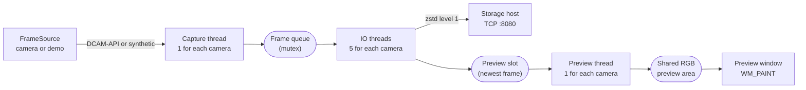

# cameraman_windows

This directory contains the capture application for the plSCM microscope. The
application operates on the camera PC. It is a C++ program for Windows. Build it
with Visual Studio.

The application does four things:

1. It opens three Hamamatsu cameras with the DCAM-API library.
2. It reads each new frame from each camera.
3. It compresses each frame and sends it to the storage host on TCP port 8080.
4. It shows a live preview of the three cameras in one window.

The application keeps no experiment data. It sends each frame immediately. The
storage host decides which archive receives the frame. This is the meaning of
the word "stateless" in the name of the directory. See
[architecture.md](../docs/architecture.md).

The application also has a **demo mode**. In demo mode it makes its own frames.
Thus you can test it on a PC that has no camera. See [Demo mode](#demo-mode).

## Files in this directory

| File | Function |
|---|---|
| `cameraman_windows.cpp` | The threads, the network code, and the window code. |
| `config.h` and `config.cpp` | The settings. The application reads them at the start from four layers. |
| `frame_source.h` and `frame_source.cpp` | The origin of the frames. There is a camera source and a demo source. |
| `cameraman.ini.example` | An example settings file with a comment for each value. |
| `sendme.h` | The 32-byte header that goes in front of each frame. The storage host reads the same format. |
| `util.h` | One function. It changes a narrow string to a wide string. |
| `common.cpp` and `common.h` | Error messages and camera information messages. These files come from the Hamamatsu SDK examples. |
| `console4.h` | Include file for the SDK examples. |
| `dcamapi4.h`, `dcamprop.h`, `dcamapi.lib` | The Hamamatsu DCAM-API SDK. Do not edit these files. |
| `cameraman_windows.vcxproj` | The Visual Studio project. Build the **x64 Release** configuration. |

The application also needs two libraries that are not in this directory. It
needs the DCAM-API runtime from Hamamatsu. It also needs **zstd** from vcpkg.

## The path of one frame

This diagram shows the path of one frame. The application repeats this path for
each frame and for each of the three cameras.



The application starts 7 threads for each camera. Thus it has 21 threads for the
three cameras. The main thread makes the window. The next four sections tell you
what each thread does.

### 1. The capture thread (`camera_thread_main`)

There is one capture thread for each camera. The function `camera_thread_main`
also starts the other threads for that camera.

The thread does these steps in a loop:

1. It gets a new buffer of 10,616,832 bytes with `malloc`.
2. It asks the `FrameSource` for the next frame. The source writes the frame
   into the buffer. The camera source reads `dcamcap_transferinfo` every
   millisecond until the camera has the frame. Then it calls
   `dcambuf_copyframe`.
3. It reads the clock of the PC. This gives the time value in milliseconds.
4. It puts the buffer and the frame data in the frame queue. A mutex protects
   the queue.

The thread does not know the origin of the frames. `frame_source.h` gives the
interface. Thus the demo mode uses the same thread.

If the queue is longer than `max_queue_depth`, the thread releases the frame and
writes a message. Each frame in the queue is 10 MB. Thus a queue with no limit
can use all the memory of the PC.

This thread operates at `REALTIME_PRIORITY_CLASS`. This is the highest priority
class in Windows. The thread must never be late, because the camera has a
limited number of frame buffers.

The cameras use an external trigger. Thus this loop waits until the trigger
hardware on the control PC starts. See [control-api.md](../docs/control-api.md).

### 2. The IO threads (`io_thread_loop`)

There are five IO threads for each camera (`io_threads`). Each thread does these
steps in a loop:

1. It removes one buffer from the frame queue. If the queue is empty, the thread
   waits 1 millisecond and tries again.
2. It copies the frame into the preview slot of that camera.
3. It compresses the frame with **zstd at level 1** (`zstd_level`). Level 1 is
   the fastest level.
4. It opens a new TCP connection to the storage host. With the setting
   `send_enable = 0` the thread stops here. Use this to test the preview with no
   server.
5. It sends the 32-byte header. Then it sends the compressed frame.
6. It closes one half of the connection. Then it closes the connection.
7. It releases the buffer with `free`.

The application opens a new connection for each frame. This is correct behavior.
The connection is the frame boundary. The storage host reads data until the
connection closes. Thus the storage host knows where the frame ends. There is no
length value in the data.

Five threads are necessary because the compression operation is slow. One thread
cannot compress 10 MB before the next frame arrives.

### 3. The preview thread (`preview_update_thread`)

There is one preview thread for each camera. The thread does these steps every 5
milliseconds:

1. It copies the newest frame from the preview slot.
2. It finds the minimum value and the maximum value of the frame.
3. It makes the frame smaller. It calculates the mean value of each square of
   4 x 4 pixels (`preview_scale`). The result is 576 x 576 pixels.
4. It changes each value to the range 0 to 255. The minimum value of the frame
   becomes 0. The maximum value becomes 255. Thus the preview always uses the
   full range of gray.
5. It writes the result into the shared RGB preview area. Camera 0 writes to the
   left part. Camera 1 writes to the center part. Camera 2 writes to the right
   part.

The preview area has three colors for each pixel. But the sensor data is gray.
Thus the thread writes the same value in the red channel, the green channel, and
the blue channel.

### 4. The main thread (`WinMain` and `WndProc`)

`WinMain` is the start of the application. It does these steps:

1. It opens a console window for the log messages.
2. It calls `load_config` and `show_config`. The console then shows every
   setting and its origin. If a value is not correct, the application shows a
   message and stops with the exit code 2.
3. If the setting `demo_mode` is 0, it calls `init_api_and_cameras`. This
   function starts DCAM-API, opens the cameras, sends the camera settings, and
   allocates the camera buffers.
4. It allocates the shared RGB preview area. This must happen before the threads
   start, because a preview thread writes into this memory.
5. It makes one `FrameSource` for each camera. Then it starts the capture
   threads.
6. It makes the window and starts the Win32 message loop.

`WndProc` receives the messages of the window. The message `WM_PAINT` draws the
window. It copies the shared RGB preview area to the screen. Then it writes the
minimum value and the maximum value of each camera below the panels. Then it
writes the mean draw time of the last 50 operations.

At the end of the paint operation, `WM_PAINT` calls `InvalidateRect`. This makes
the next paint operation. Thus the window draws continuously.

## The 32-byte header

`sendme.h` gives the header. The application sends this structure in front of
each compressed frame.

| Value | Type | Function |
|---|---|---|
| `cameraid` | `uint8_t` | The number of the camera, from 0 to 2 |
| `frameid` | `uint32_t` | The number of the frame. The first value is 1. |
| `burstid` | `uint32_t` | Not used. The value is always 0. |
| `expid` | `uint32_t` | The value is 0 in a real run. In demo mode the value is `demo_expid`. |
| `timecode` | `uint64_t` | Milliseconds after the start of the Unix epoch |
| `payload_size` | `uint32_t` | The size of the frame **before** compression |

These values are 25 bytes. But the header is 32 bytes, because the compiler adds
alignment bytes. **The format changes with the ABI.** If you change `sendme.h`,
you must also change the parser in
[`sndif_server/src/main.rs`](../sndif_server/src/main.rs). Do the two changes in
the same commit. See [frame-protocol.md](../docs/frame-protocol.md).

## The settings

The application reads its settings at the start. It does not use constants in
the code. It reads four layers. A later layer replaces an earlier layer:

1. The default values in `config.cpp`. The application operates correctly with
   no configuration.
2. The file `cameraman.ini` in the directory of the executable file. Copy
   `cameraman.ini.example` and remove the `#` characters that you need.
3. The environment variables. The name is `PLSCM_` and the name of the setting
   in capital letters. Example: `PLSCM_SERVER_HOST`.
4. The command line. Example: `cameraman_windows.exe --demo_mode=1`.

Use `--config=<path>` or `PLSCM_CONFIG` to read a different file.

This is the same method as `sndif_server` and `sndif_test_client`. See
[operations.md](../docs/operations.md#configuration-of-the-two-rust-programs).

The console shows every value and its origin at the start. Keep that log. It
tells you the configuration of that run.

| Setting | Default | Function |
|---|---|---|
| `server_host` | `sndif.example.com` | The address of the storage host. **The default is an example. It is not a real host.** |
| `server_port` | `8080` | The TCP port of the storage host |
| `send_enable` | `1` | With 0 the application opens no connection |
| `zstd_level` | `1` | The compression level. Level 1 is the fastest. |
| `camera_count` | `3` | The number of cameras |
| `frame_width`, `frame_height` | `2304` | The size of one frame in pixels |
| `frame_bytes_per_px` | `2` | The number of bytes for each pixel. The value must be 2. |
| `io_threads` | `5` | The number of IO threads for each camera |
| `dcam_buffers` | `1000` | The number of frame buffers in the camera driver |
| `max_queue_depth` | `64` | The largest number of frames in the queue of one camera. 0 gives no limit. |
| `h_interval` | `0.000004868` | The line interval of the rolling shutter in seconds |
| `exposure_time` | `0.000017632` | The exposure time of one line in seconds |
| `trigger_interval` | `0.002` | The period of the output triggers in seconds |
| `hsync` | `150` | The number of lead-in lines before the first sensor line |
| `preview_scale` | `4` | The preview is this number of times smaller than the frame |
| `demo_mode` | `0` | With 1 the application makes its own frames |
| `demo_interval_ms` | `100` | The time between two demo frames |
| `demo_pattern` | `bars` | `bars`, `noise`, or `file` |
| `demo_file` | (empty) | The frame file for the pattern `file` |
| `demo_noise_bits` | `16` | The number of bits of noise, from 1 to 16 |
| `demo_expid` | `0xDE305` | The mark of a demo frame in the header |

The values `h_interval`, `hsync`, and `frame_height` must agree with the
wavetables on the control PC. Each wavetable has 150 + 2304 + 100 = 2554 values.
If you change one of these three values, you must make the wavetables again. See
[calibration.md](../docs/calibration.md).

Two groups of settings are different:

- **Start only.** `camera_count`, the frame size, the thread counts,
  `dcam_buffers`, and `preview_scale` give the size of the memory buffers. The
  application allocates the buffers one time.
- **Live.** The other settings apply to the next frame only. But the application
  does not read the settings again while it operates. To change one, stop the
  application and start it again.

The function `assignSettings` sends the timing settings to one camera. The
application calls this function 5 times for each camera. The camera does not
always accept the first set of values.

## Demo mode

With `demo_mode = 1` the application makes its own frames. It does not open a
camera. Thus you can test the application on a PC that has no microscope.

The application links `dcamapi.lib` with the linker option
`/DELAYLOAD:dcamapi.dll`. Windows then loads `dcamapi.dll` at the first DCAM
call only. In demo mode there is no DCAM call. Thus the application also
operates on a PC that does not have the DCAM-API runtime.

Everything after the frame source is the same code in the two modes: the queue,
the compression, the network, the preview, and the window. Thus a test in demo
mode is a test of the application.

Start a demo like this:

```bat
set PLSCM_DEMO_MODE=1
set PLSCM_SERVER_HOST=127.0.0.1
cameraman_windows.exe
```

The setting `demo_pattern` gives the contents of the frames:

| Pattern | Contents |
|---|---|
| `bars` | Noise and one bright band. Each camera has a different band position. Thus you can see immediately if the channels are not in the correct sequence. |
| `noise` | Noise only. This gives the highest load on the compressor. |
| `file` | A real frame from a file. Use one member of a zip archive of the storage host. This gives the most exact compression ratio. |

The setting `demo_noise_bits` controls the compression ratio. The value 16 gives
a ratio near 1. The value 4 gives a high ratio.

Each demo frame has two marks:

- **The number of the frame.** 32 blocks at the top of the frame. A bright block
  is a bit with the value 1. Thus you can find the number of a frame in a saved
  archive.
- **A square that moves.** Its position changes with each frame. If the square
  stops in the preview, the capture path stopped.

**Demo data must never look like microscope data.** The application uses four
marks:

1. The title of the window contains `DEMO MODE - NOT REAL DATA`.
2. The console shows a group of lines with the same text.
3. Each frame has `expid = demo_expid` in its header. A real run always has the
   value 0. The storage host writes this value in its log.
4. Give the archive a name that starts with `demo_` on port 8090 of the storage
   host.

**Do not put `demo_mode = 1` in the `cameraman.ini` of the microscope PC.**

For the full test procedure, see
[cameraman-demo-mode.md](../docs/cameraman-demo-mode.md#how-to-test-the-demo-mode).

## Memory

The application uses a large amount of memory. Calculate the memory before you
change a value.

- One frame is 2304 x 2304 x 2 bytes = **10,616,832 bytes** (about 10 MB).
- `dcambuf_alloc` gets `dcam_buffers` frames for each camera. This is 1000 x
  10 MB = **about 10 GB for each camera**. For three cameras this is about
  **32 GB**.
- Each frame in the frame queue and in the IO threads is one more 10 MB buffer.
  The setting `max_queue_depth` gives the limit of the queue.

The camera PC must have sufficient RAM. If the PC has less RAM, `dcambuf_alloc`
fails. Decrease `dcam_buffers` in this condition. The console shows the
calculated size at the start.

Demo mode does not use `dcam_buffers`. Thus a demo needs much less memory. For a
quick test on a small PC, decrease the frame size:

```bat
cameraman_windows.exe --demo_mode=1 --frame_width=256 --frame_height=256
```

## How to start and how to stop

To start the application, build the **x64 Release** configuration and start
`cameraman_windows.exe`. The application opens a console window and a window
with the name "Camera Live Preview". The title of the window shows the address
of the storage host.

The application needs the number of cameras in `camera_count`. If the PC has
less cameras, `init_api_and_cameras` shows a message and the application stops.
Use `demo_mode = 1` to test with no camera.

To stop the application, close the preview window. Then stop the process. Ctrl-C
in the console window also stops it. The application has no clean shutdown
sequence for the capture threads. The capture loop stops only if the frame
source has no more frames. The function `kill_api_and_cameras` is in the code,
but the application does not call it.

