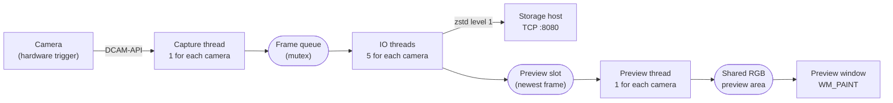

# cameraman_windows

This directory contains the capture application for the plSCM microscope. The
application operates on the camera PC. It is a C++ program for Windows. Build it
with Visual Studio.

The application does four things:

1. It opens three Hamamatsu cameras with the DCAM-API library.
2. It reads each new frame from each camera.
3. It compresses each frame and sends it to the storage host on TCP port 8080.
4. It shows a live preview of the three cameras in one window.

The application keeps no experiment data. It sends each frame immediately. The
storage host decides which archive receives the frame. This is the meaning of
the word "stateless" in the name of the directory. See
[architecture.md](../docs/architecture.md).

## Files in this directory

| File | Function |
|---|---|
| `cameraman_windows.cpp` | The full application. It contains all the threads, the network code, and the window code. |
| `sendme.h` | The 32-byte header that goes in front of each frame. The storage host reads the same format. |
| `util.h` | One function. It changes a narrow string to a wide string. |
| `common.cpp` and `common.h` | Error messages and camera information messages. These files come from the Hamamatsu SDK examples. |
| `console4.h` | Include file for the SDK examples. |
| `dcamapi4.h`, `dcamprop.h`, `dcamapi.lib` | The Hamamatsu DCAM-API SDK. Do not edit these files. |
| `cameraman_windows.vcxproj` | The Visual Studio project. Build the **x64 Release** configuration. |

The application also needs two libraries that are not in this directory. It
needs the DCAM-API runtime from Hamamatsu. It also needs **zstd** from vcpkg.

## The path of one frame

This diagram shows the path of one frame. The application repeats this path for
each frame and for each of the three cameras.

The application starts 7 threads for each camera. Thus it has 21 threads for the
three cameras. The main thread makes the window. The next four sections tell you
what each thread does.

### 1. The capture thread (`camera_thread_main`)

There is one capture thread for each camera. The function
`camera_thread_main` also starts the other threads for that camera.

The thread does these steps in a loop:

1. It reads `dcamcap_transferinfo` every millisecond. This function tells the
   thread how many frames the camera has. The thread waits until the number is
   larger than the number of frames that it read before.
2. It gets a new buffer of 10,616,832 bytes with `malloc`.
3. It copies the frame into the buffer with `dcambuf_copyframe`.
4. It reads the clock of the PC. This gives the time value in milliseconds.
5. It puts the buffer and the frame data in the frame queue. A mutex protects
   the queue.

This thread operates at `REALTIME_PRIORITY_CLASS`. This is the highest priority
class in Windows. The thread must never be late, because the camera has a limited
number of frame buffers.

The cameras use an external trigger. Thus this loop waits until the trigger
hardware on the control PC starts. See
[control-api.md](../docs/control-api.md).

### 2. The IO threads (`io_thread_loop`)

There are five IO threads for each camera (`IO_THREAD_CONCURRENCY`). Each thread
does these steps in a loop:

1. It removes one buffer from the frame queue. If the queue is empty, the thread
   waits 1 millisecond and tries again.
2. It copies the frame into the preview slot of that camera.
3. It compresses the frame with **zstd at level 1**. Level 1 is the fastest
   level.
4. It opens a new TCP connection to the storage host.
5. It sends the 32-byte header. Then it sends the compressed frame.
6. It closes one half of the connection. Then it closes the connection.
7. It releases the buffer with `free`.

The application opens a new connection for each frame. This is correct behavior.
The connection is the frame boundary. The storage host reads data until the
connection closes. Thus the storage host knows where the frame ends. There is no
length value in the data.

Five threads are necessary because the compression operation is slow. One thread
cannot compress 10 MB before the next frame arrives.

### 3. The preview thread (`preview_update_thread`)

There is one preview thread for each camera. The thread does these steps every 5
milliseconds:

1. It copies the newest frame from the preview slot.
2. It finds the minimum value and the maximum value of the frame.
3. It makes the frame smaller. It calculates the mean value of each square of
   4 x 4 pixels (`PREVIEW_SCALE_FACTOR`). The result is 576 x 576 pixels.
4. It changes each value to the range 0 to 255. The minimum value of the frame
   becomes 0. The maximum value becomes 255. Thus the preview always uses the
   full range of gray.
5. It writes the result into the shared RGB preview area. Camera 0 writes to the
   left part. Camera 1 writes to the center part. Camera 2 writes to the right
   part.

The preview area has three colors for each pixel. But the sensor data is gray.
Thus the thread writes the same value in the red channel, the green channel, and
the blue channel.

### 4. The main thread (`WinMain` and `WndProc`)

`WinMain` is the start of the application. It does these steps:

1. It opens a console window for the log messages.
2. It calls `init_api_and_cameras`. This function starts DCAM-API, opens the
   three cameras, sends the camera settings, and allocates the camera buffers.
3. It starts the three capture threads.
4. It allocates the shared RGB preview area.
5. It makes the window and starts the Win32 message loop.

`WndProc` receives the messages of the window. The message `WM_PAINT` draws the
window. It copies the shared RGB preview area to the screen. Then it writes the
minimum value and the maximum value of each camera below the three panels. Then
it writes the mean draw time of the last 50 operations.

At the end of the paint operation, `WM_PAINT` calls `InvalidateRect`. This makes
the next paint operation. Thus the window draws continuously.

## The 32-byte header

`sendme.h` gives the header. The application sends this structure in front of
each compressed frame.

| Value | Type | Function |
|---|---|---|
| `cameraid` | `uint8_t` | The number of the camera, from 0 to 2 |
| `frameid` | `uint32_t` | The number of the frame. The first value is 1. |
| `burstid` | `uint32_t` | Not used. The value is always 0. |
| `expid` | `uint32_t` | Not used. The value is always 0. |
| `timecode` | `uint64_t` | Milliseconds after the start of the Unix epoch |
| `payload_size` | `uint32_t` | The size of the frame **before** compression |

These values are 25 bytes. But the header is 32 bytes, because the compiler adds
alignment bytes. **The format changes with the ABI.** If you change `sendme.h`,
you must also change the parser in
[`sndif_server/src/main.rs`](../sndif_server/src/main.rs). Do the two changes in
the same commit. See [frame-protocol.md](../docs/frame-protocol.md).

## The settings in the code

All the settings are `#define` values near the start of
`cameraman_windows.cpp`. To change a setting, you must edit the file and build
the application again.

| Name | Value | Function |
|---|---|---|
| `SERVERIP` | `sndif.cai-lab.org` | The address of the storage host |
| `PORT` | `8080` | The TCP port of the storage host |
| `CAMERA_NUMS` | `3` | The number of cameras |
| `IO_THREAD_CONCURRENCY` | `5` | The number of IO threads for each camera |
| `FRAME_BUFFER_COUNT` | `1000` | The number of frame buffers in the camera driver |
| `FRAME_WIDTH`, `FRAME_HEIGHT` | `2304` | The size of one frame in pixels |
| `FRAME_BYTES_PER_PX` | `2` | The number of bytes for each pixel |
| `PREVIEW_SCALE_FACTOR` | `4` | The preview is 4 times smaller than the frame |
| `H_INTERVAL` | `0.000004868` | The line interval of the rolling shutter in seconds |
| `EXPOSURE_TIME` | `0.000017632` | The exposure time of one line in seconds |
| `TRIGGER_INTERVAL` | `0.002` | The period of the output triggers in seconds |
| `HSYNC` | `150` | The number of lead-in lines before the first sensor line |

The values `H_INTERVAL`, `HSYNC`, and `FRAME_HEIGHT` must agree with the
wavetables on the control PC. Each wavetable has 150 + 2304 + 100 = 2554 values.
If you change one of these three values, you must make the wavetables again. See
[calibration.md](../docs/calibration.md).

The function `assignSettings` sends the settings to one camera. The application
calls this function 5 times for each camera. The camera does not always accept
the first set of values.

## Memory

The application uses a large amount of memory.
Calculate the memory before you change a value.

- One frame is 2304 x 2304 x 2 bytes = **10,616,832 bytes** (about 10 MB).
- `dcambuf_alloc` gets `FRAME_BUFFER_COUNT` frames for each camera. This is 1000
  x 10 MB = **about 10 GB for each camera**. For three cameras this is about
  **32 GB**.
- Each frame in the frame queue and in the IO threads is one more 10 MB buffer.

The camera PC must have sufficient RAM. If the PC has less RAM,
`dcambuf_alloc` fails. Decrease `FRAME_BUFFER_COUNT` in this condition.

## How to start and how to stop

To start the application, build the **x64 Release** configuration and start
`cameraman_windows.exe`. The application opens a console window and a window
with the name "Camera Live Preview".

The application needs exactly three cameras. If the number of cameras is
different, `init_api_and_cameras` gives an error message and the application
does not capture.

To stop the application, close the preview window. Then stop the process. The
application has no clean shutdown sequence. The capture loop has no exit
condition. The function `kill_api_and_cameras` is in the code, but the
application does not call it.
