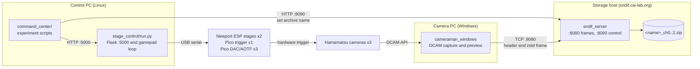

# Architecture

The plSCM system has parts on three computers. No program in this repository
operates alone. A complete microscope needs four programs. The programs use USB
serial, HTTP, and TCP to send data.

## Functions of the parts

| Part | Computer | Function |
|---|---|---|
| [`stage_control/`](../stage_control/) | Control PC | Controls all the serial devices. Gives access to them through a Flask HTTP API. Also moves the stages from an Xbox gamepad. |
| [`command_center/`](../command_center/) | Control PC | Contains the experiment logic. Sends commands to the Flask API. Does not use the serial ports. |
| [`cameraman_windows_stateless/`](../cameraman_windows_stateless/) | Camera PC | Controls three Hamamatsu cameras with DCAM-API. Compresses the frames. Sends them to the storage host. Shows a live preview. |
| [`sndif_server/`](../sndif_server/) | Storage host | Receives the frames. Sorts them by camera. Writes them to one zip archive for each channel. |
| [`sndif_test_client/`](../sndif_test_client/) | Any computer | Makes test data for the frame input path. |

The name "stateless" tells you that the camera application keeps no experiment
data. The application operates continuously and sends each frame immediately.
The storage host puts each frame in the correct archive. To do this, the storage
host uses the last name that it received on the control port.

## The three time scales

The plSCM system has three different time scales. Keep them separate.

1. **Line time.** The cameras use a rolling shutter. The line interval
   (`H_INTERVAL`) is 4.868 microseconds. The exposure time is 17.632
   microseconds. The illumination must move at the same rate as the active
   sensor line.
2. **Frame time.** One frame is 2304 x 2304 pixels. Each pixel has 2 bytes.
   Thus one frame is 10,616,832 bytes. The camera thread reads
   `dcamcap_transferinfo` until a new frame is available. Then the thread copies
   the frame and sends it to an IO thread.
3. **Experiment time.** The scripts in `command_center` move the stage, set an
   archive name, send N triggers, and then wait. The system repeats the line
   operations and the frame operations many times in one step of this loop.

The waveform tables in [`stage_control/`](../stage_control/) use the line time
scale. Each table has exactly **2554 values**. The value 2554 is the sum of
150, 2304, and 100:

- **150** lead-in lines. This agrees with the `HSYNC` value of 150 in the
  camera.
- **2304** active lines. There is one line for each sensor line.
- **100** trailing lines.

Value *i* of a DAC wavetable gives the galvo position for sensor line
*i* minus 150. Value *i* of an AOTF table tells you if the laser is on for that
line. This relation between the values and the sensor lines makes the
calibration in [calibration.md](calibration.md) possible.

## Threads

### cameraman_windows

The function `camera_thread_main` starts these threads for each of the three
cameras:

- **One capture thread.** The thread operates at `REALTIME_PRIORITY_CLASS`. It
  reads the camera until the next frame is available. Then it gets a new buffer
  with `malloc` and copies the frame with `dcambuf_copyframe`. Then it adds a
  time value in milliseconds. Last, it puts the data in a queue with a mutex.
- **Five IO threads** (`IO_THREAD_CONCURRENCY`). Each thread gets a buffer from
  the queue and copies it to the preview area. Then it compresses the buffer
  with zstd at level 1. Then it opens a new TCP connection and sends the header
  and the payload. Last, it closes the connection and releases the buffer.
- **One preview thread.** The thread decreases the size of the newest frame by
  `PREVIEW_SCALE_FACTOR` (4). Then it changes the data to 8-bit with the minimum
  value and the maximum value of that frame. Then it writes the result into the
  shared RGB preview area at the horizontal offset of this camera.

`WinMain` controls the Win32 message loop. It draws the three preview panels of
576 pixels adjacent to each other. Below the panels it shows the minimum value
and the maximum value for each camera and the frame rate.

The camera opens a new connection for each frame. This is correct behavior. It
keeps the transmitter stateless. It also lets the receiver use `read_to_end` to
find the end of each frame. But the frame input path opens about three
sockets in each frame time. If the data rate is too low, examine this first.

### sndif_server

- **10 parser threads** (`SERVER_THREADS`) get the open sockets from a shared
  crossbeam channel. Each thread reads the 32-byte header. Then it reads the
  payload to the end of the data. Then it sends the frame to the writer channel
  for that camera.
- **Three writer threads** (`CAMERA_COUNT`), one for each camera. Each thread
  controls one `ZipWriter`. Before each frame, the thread reads its name
  channel. If a new name is available, the thread closes the zip file. Then it
  opens a new file with the name `<name>_ch<N>.zip`.
- **One control thread** gives the HTTP endpoint for the archive name on
  port 8090.
- **One listener thread** accepts the connections on port 8080. This thread
  operates in non-blocking mode. Thus it can find the Ctrl-C signal between two
  connections.

An environment variable sets the two addresses, the number of cameras, the
number of parser threads, and the output directory. See
[operations.md](operations.md#configuration-of-the-two-rust-programs).

The shutdown sequence needs Ctrl-C. Ctrl-C sends a signal to `kill_sender`. The
listener thread stops and releases `tcp_sender`. The parser threads then stop
and the frame channels disconnect. Each writer thread then closes its zip file
correctly. If you use a different method to stop the server, the zip files are
not complete.

### stage_control/run.py

The Flask application operates on a background thread. The parameter
`use_reloader=False` prevents a second process. The main thread stays in the
gamepad loop. Both threads use the same `stage_control` objects. Each serial
device has its own `threading.Lock`. Thus an HTTP command and a gamepad command
cannot mix their bytes on the serial line.

The endpoint `/disable_gamepad` is available. Use it to prevent a movement of
the stage from a gamepad stick that is not at the center position.

## Ports

| Port | Computer | Protocol | Function |
|---|---|---|---|
| 5000 | Control PC | HTTP | Controls the stage, the trigger, the galvo, and the AOTF. See [control-api.md](control-api.md). |
| 5001 | Control PC | HTTP | Gives the `get_image`, `buffer_size`, and `clear_buffer` functions. This service is not in this repository. See [operations.md](operations.md#external-services). |
| 8080 | Storage host | TCP | Receives the frames. See [frame-protocol.md](frame-protocol.md). |
| 8090 | Storage host | HTTP | Sets the archive name. |

## Related documents

- [frame-protocol.md](frame-protocol.md) gives the data format between the
  camera and the storage host.
- [control-api.md](control-api.md) gives the HTTP API and the serial protocols
  below it.
- [calibration.md](calibration.md) tells you how to make the galvo tables and
  the AOTF tables.
- [operations.md](operations.md) tells you how to start the system and how to do
  a scan.
